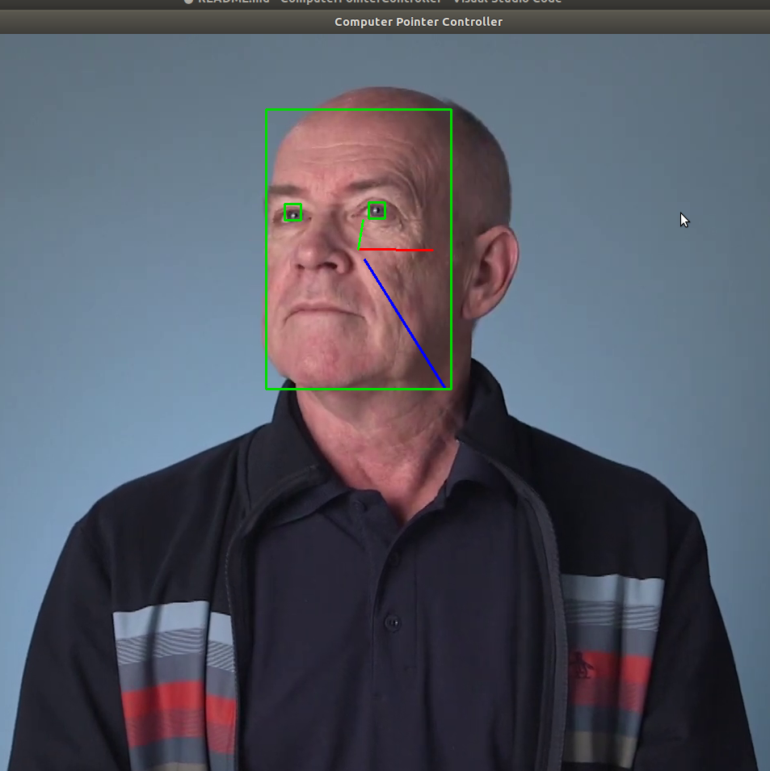

# Computer Pointer Controller

*TODO:* Write a short introduction to your project.

This project demonstrates a computer pointer controller by implementing a pipeline of four different Intel's pretrained models. These models are face detection model, landmarks regression model, head pose estimation model and gaze estimation model. Refer below the list of the models;

        1. face-detection-adas-binary-0001
        2. gaze-estimation-adas-0002
        3. head-pose-estimation-adas-0001
        4. landmarks-regression-retail-0009

This project implements a pipeline of models input and outputs. It takes a video or camera feed as an input for the face detection model and outputs the face region of interests (roi). Landmarks regression model gets the face roi as an input and detects facial landmarks, right eye and left eye. Also the head pose estimation model takes the facial roi as input and detects the head pose angles, yaw, pitch and roll. The landmarks and the head pose angles are then fed to the gaze estimation model to predict the direction or cordinates of gaze by the person. These coordinates are then fed to the pyautogui to move the computer pointer to where the person is gazing.


Format: 


## Project Set Up and Installation
*TODO:* Explain the setup procedures to run your project. For instance, this can include your project directory structure, the models you need to download and where to place them etc. Also include details about how to install the dependencies your project requires.

This project comes together with it's virtual environment. Refer to the project structure below, the virtual environment is the cpc-project-env folder. Once you have downloaded this repository, change directory into it and run the command "source cpc-project-env/bin/activate" to activate the environment. 

However, to run on your own environment, refer to the requirements.txt file for all the required software that are needed to be installed before executing. This project had been tested and executed on a Linux operating system with Intel's Openvino Toolkit 2020.1. The hardware used had an Intel Core i7 processor (8th Gen) with integrated GPU. 

Refer below is the project structure:

The bin folder contains the demo video file, the models folder contains all the Intel's Pretrained models needed for execution, and the src folder contains all necessary python files.
```
📦ComputerPointerController
 ┣ 📂bin
 ┃ ┗ 📜demo.mp4
 ┣ 📂cpc-project-env
 ┃ ┣ 📂bin
 ┃   ┣ 📜activate
 ┃  
 ┣ 📂models
 ┃ ┗ 📂intel
 ┃   ┣ 📂face-detection-adas-0001
 ┃   ┃ ┣ 📂FP16
 ┃   ┃ ┃ ┣ 📜face-detection-adas-0001.bin
 ┃   ┃ ┃ ┗ 📜face-detection-adas-0001.xml
 ┃   ┃ ┗ 📂FP32
 ┃   ┃ ┃ ┣ 📜face-detection-adas-0001.bin
 ┃   ┃ ┃ ┗ 📜face-detection-adas-0001.xml
 ┃   ┣ 📂face-detection-adas-binary-0001
 ┃   ┃ ┗ 📂INT1
 ┃   ┃ ┃ ┣ 📜face-detection-adas-binary-0001.bin
 ┃   ┃ ┃ ┗ 📜face-detection-adas-binary-0001.xml
 ┃   ┣ 📂gaze-estimation-adas-0002
 ┃   ┃ ┣ 📂FP16
 ┃   ┃ ┃ ┣ 📜gaze-estimation-adas-0002.bin
 ┃   ┃ ┃ ┗ 📜gaze-estimation-adas-0002.xml
 ┃   ┃ ┗ 📂FP32
 ┃   ┃ ┃ ┣ 📜gaze-estimation-adas-0002.bin
 ┃   ┃ ┃ ┗ 📜gaze-estimation-adas-0002.xml
 ┃   ┣ 📂head-pose-estimation-adas-0001
 ┃   ┃ ┣ 📂FP16
 ┃   ┃ ┃ ┣ 📜head-pose-estimation-adas-0001.bin
 ┃   ┃ ┃ ┗ 📜head-pose-estimation-adas-0001.xml
 ┃   ┃ ┗ 📂FP32
 ┃   ┃ ┃ ┣ 📜head-pose-estimation-adas-0001.bin
 ┃   ┃ ┃ ┗ 📜head-pose-estimation-adas-0001.xml
 ┃   ┗ 📂landmarks-regression-retail-0009
 ┃     ┣ 📂FP16
 ┃     ┃ ┣ 📜landmarks-regression-retail-0009.bin
 ┃     ┃ ┗ 📜landmarks-regression-retail-0009.xml
 ┃     ┗ 📂FP32
 ┃       ┣ 📜landmarks-regression-retail-0009.bin
 ┃       ┗ 📜landmarks-regression-retail-0009.xml
 ┣ 📂src
 ┃ ┣ 📜face_detection.py
 ┃ ┣ 📜gaze_estimation.py
 ┃ ┣ 📜head_pose_estimation.py
 ┃ ┣ 📜input_feeder.py
 ┃ ┣ 📜landmarks_detection.py
 ┃ ┣ 📜main.py
 ┃ ┣ 📜model.py
 ┃ ┣ 📜model_module.py
 ┃ ┣ 📜mouse_controller.py
 ┃ ┗ 📜utils.py
 ┣ 📜README.md
 ┣ 📜cpc_image.png
 ┗ 📜requirements.txt
```

## Demo
*TODO:* Explain how to run a basic demo of your model.

Use the command line tool in Windows or terminal in Linux to execute the application. To run the application, change directory into the root folder and execute the following commands:

    1. Sample 1: Using CPU to run inference on the frames
```
python3 src/main.py -i 'cam'  -m_fd "models/intel/face-detection-adas-0001/FP32/face-detection-adas-0001" -m_lm "models/intel/landmarks-regression-retail-0009/FP32/landmarks-regression-retail-0009" -m_hp "models/intel/head-pose-estimation-adas-0001/FP32/head-pose-estimation-adas-0001" -m_ge "models/intel/gaze-estimation-adas-0002/FP32/gaze-estimation-adas-0002" --device_fd 'CPU' --device_lm 'CPU' --device_ge 'CPU' --device_hp 'CPU'  --verbose
```
    2. Sample 2: Using GPU to run inference on the frames
```
python3 src/main.py -i 'cam'  -m_fd "models/intel/face-detection-adas-0001/FP32/face-detection-adas-0001" -m_lm "models/intel/landmarks-regression-retail-0009/FP32/landmarks-regression-retail-0009" -m_hp "models/intel/head-pose-estimation-adas-0001/FP32/head-pose-estimation-adas-0001" -m_ge "models/intel/gaze-estimation-adas-0002/FP32/gaze-estimation-adas-0002" --device_fd 'GPU' --device_lm 'GPU' --device_ge 'GPU' --device_hp 'GPU'  --verbose
```
For help on which arguments to use, execute the below command;
```
        python3 src/main.py --help
```

## Documentation
*TODO:* Include any documentation that users might need to better understand your project code. For instance, this is a good place to explain the command line arguments that your project supports.


## Benchmarks
*TODO:* Include the benchmark results of running your model on multiple hardwares and multiple model precisions. Your benchmarks can include: model loading time, input/output processing time, model inference time etc.

Models load time and inference time were performed on two different hardware. They were the intergrated GPU - GeForce MX150/PCIe/SSE2, and CPU - Intel® Core™ i7-8550U CPU @ 1.80GHz × 8. Here are different scenarios and their respective results.

    1. Scenario 1: All models perfomed inference on CPU    

Sample command executed as per below;

    ```
    python3 src/main.py -i 'cam'  -m_fd "models/intel/face-detection-adas-binary-0001/INT1/face-detection-adas-binary-0001" -m_lm "models/intel/landmarks-regression-retail-0009/FP32/landmarks-regression-retail-0009" -m_hp "models/intel/head-pose-estimation-adas-0001/FP32/head-pose-estimation-adas-0001" -m_ge "models/intel/gaze-estimation-adas-0002/FP32/gaze-estimation-adas-0002" --device_fd 'CPU' --device_lm 'CPU' --device_ge 'CPU' --device_hp 'CPU'  --verbose --output_path 'results'
    ```

    Results shown that when pipeline process executed within 11 seconds, frames processed per second with a batch of 2 was 7.18. And total time taken to load all models was 0.3132 seconds.


    2. Scenario 2: All models performed inference on GPU

    Sample command executed;

    ```
    python3 src/main.py -i 'cam'  -m_fd "models/intel/face-detection-adas-binary-0001/INT1/face-detection-adas-binary-0001" -m_lm "models/intel/landmarks-regression-retail-0009/FP32/landmarks-regression-retail-0009" -m_hp "models/intel/head-pose-estimation-adas-0001/FP32/head-pose-estimation-adas-0001" -m_ge "models/intel/gaze-estimation-adas-0002/FP32/gaze-estimation-adas-0002" --device_fd 'GPU' --device_lm 'GPU' --device_ge 'GPU' --device_hp 'GPU'  --verbose --output_path 'results'
    ```

    Results shown that when pipeline process executed within 13.14 seconds, frames processed per second with a batch of 2 was 7.238. And total time taken to load all models was 46.38 seconds.
    

    So it was evident that IGPUs takes longer load time than CPU.

Another benchmark tests were done on multiple precisions. Below are the findings of the three main precisions used for each models.

    1. Scenario 1: All models with precisions FP32 on CPU
    Sample command executed as per below;
    ```
    python3 src/main.py -i 'cam'  -m_fd "models/intel/face-detection-adas-0001/FP32/face-detection-adas-0001" -m_lm "models/intel/landmarks-regression-retail-0009/FP32/landmarks-regression-retail-0009" -m_hp "models/intel/head-pose-estimation-adas-0001/FP32/head-pose-estimation-adas-0001" -m_ge "models/intel/gaze-estimation-adas-0002/FP32/gaze-estimation-adas-0002" --device_fd 'CPU' --device_lm 'CPU' --device_ge 'CPU' --device_hp 'CPU'  --verbose --output_path 'results'
    ```
    Results shown that when pipeline process executed within 42.3 seconds, frames processed per second with a batch of 2 was 7.39. And total time taken to load all models was 0.3612 seconds.

    2. Scenario 2: All models with precision FP16 on CPU
    Sample command executed as per below
    ```
    python3 src/main.py -i 'cam'  -m_fd "models/intel/face-detection-adas-0001/FP16/face-detection-adas-0001" -m_lm "models/intel/landmarks-regression-retail-0009/FP16/landmarks-regression-retail-0009" -m_hp "models/intel/head-pose-estimation-adas-0001/FP16/head-pose-estimation-adas-0001" -m_ge "models/intel/gaze-estimation-adas-0002/FP16/gaze-estimation-adas-0002" --device_fd 'CPU' --device_lm 'CPU' --device_ge 'CPU' --device_hp 'CPU'  --verbose --output_path 'results'
    ```
    Results shown that when pipeline process executed within 23.8 seconds, frames processed per second with a batch of 2 was 7.35. And total time taken to load all models was 0.3471 seconds.

## Results
*TODO:* Discuss the benchmark results and explain why you are getting the results you are getting. For instance, explain why there is difference in inference time for FP32, FP16 and INT8 models.

## Stand Out Suggestions
This is where you can provide information about the stand out suggestions that you have attempted.

### Async Inference
If you have used Async Inference in your code, benchmark the results and explain its effects on power and performance of your project.

### Edge Cases
There will be certain situations that will break your inference flow. For instance, lighting changes or multiple people in the frame. Explain some of the edge cases you encountered in your project and how you solved them to make your project more robust.
